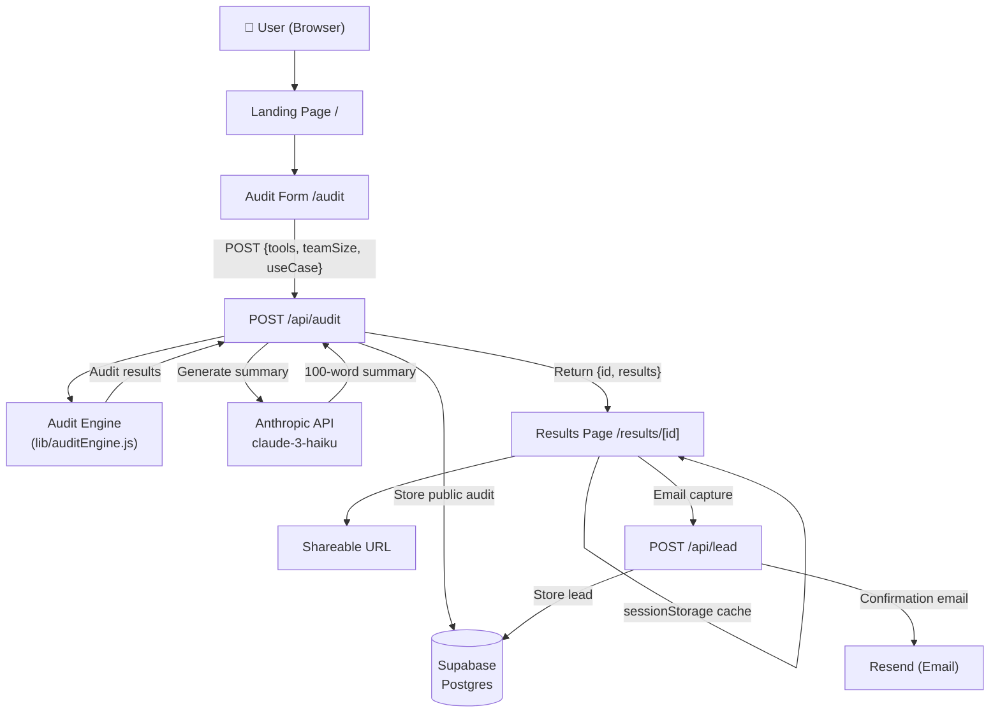

# Architecture

## System Diagram

## Data Flow: Input → Audit Result

1. **User inputs** tools, plans, seats, spend, team size, use case via the audit form
2. Form submits to `POST /api/audit`
3. Server runs `runAudit()` — a pure function that loops each tool through rule checks:
   - Billing mismatch (paying more than plan price × seats)
   - Over-provisioned tier (e.g., Team plan with 2 users)
   - Use-case mismatch (coding tools for writing teams)
   - Redundant tools (3 coding assistants)
   - Cross-tool redundancy (API + subscription overlap)
4. `generateAISummary()` calls Anthropic API with structured audit data → 100-word narrative
5. Full result stored in Supabase with a UUID
6. Result returned to client + cached in `sessionStorage`
7. User redirected to `/results/{uuid}`

## Stack Choice

| Layer | Choice | Reason |
|---|---|---|
| Framework | Next.js 15 (App Router) | Co-located API routes, server components, built-in OG metadata |
| Language | JavaScript | Speed over TypeScript for a 7-day build; types in JSDoc comments |
| Styling | Tailwind + inline styles | Tailwind for utilities, inline for dynamic/conditional styles |
| Database | Supabase (Postgres) | Zero setup, REST API included, generous free tier |
| AI | Anthropic Claude Haiku | Fast, cheap, high quality for 100-word summaries |
| Email | Resend | Simple API, 3000 free emails/mo |
| Deploy | Vercel | Zero-config Next.js deploy |

## Scaling to 10k Audits/Day

- **Add Redis (Upstash)** for rate limiting instead of in-memory Map
- **Cache popular audit results** — if 5 users have the same tool/plan combo, return cached recommendations
- **Database reads**: Add read replicas in Supabase; the results page currently does a full SELECT by UUID which is fast but add a covering index on `id`
- **Move AI summary to background job**: Return the audit immediately, generate summary async with a Supabase Edge Function, update record when done, client polls or uses Supabase Realtime
- **CDN for OG images**: Generate static OG image PNGs per audit ID, cache at Cloudflare edge
